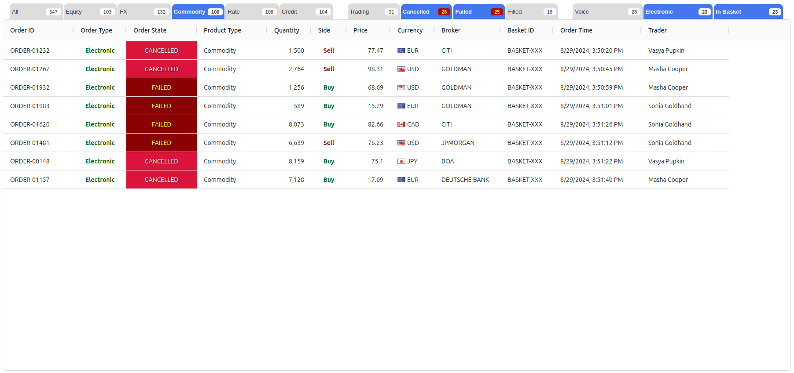

# A Performance-Optimized Angular Application

This project demonstrates effective techniques for handling high-frequency, high-volume updates in Single-Page Applications (SPAs). By employing strategies like distinct throttling, lazy sampling, transactional delta updates, and Web Workers, we've optimized performance for scenarios like financial applications with large, rapidly-changing order grids (Blotters).

## Project Setup

This TypeScript project uses [NodeJS](www.nodejs.org), [Angular](www.angular.dev) and [Ag-Grid](www.ag-grid.com). To get started:

1. Clone the repository.
2. Navigate to the project directory.
3. Run ``npm install``.

**Note**: This project is for demonstration purposes only and is not production-ready.

## The Challenge

Optimize a Blotter (order grid) for financial applications to ensure consistent, responsive, and lightning-fast rendering, even with massive data updates. 

### The Blotter should:
* Support quick filtering based on various criteria.
* Display total order counts for specific filter conditions.

### Filter Groups

The Blotter includes three filter groups:

* **Product Type**: Mutual exclusive selection.
* **Order State**: Multiple selection. Counters reflect Product Type group selection.
* **Extra** mixed selection: Includes mutual exclusive filters like "Voice" and "Electronic," as well as non-exclusive filters like "Basket." Order counts reflect Product Type and Order State group selections.

Below is selecting filters for "Commodity," "Electronic," and "Basket" orders in a "Cancelled" or "Failed" state.

The application generates 10,000 random orders (new and updates) with high frequency.

## Optimization Techniques

* **Throttling and Batching**: The human eye can't detect changes faster than about 300 milliseconds. Order updates are throttled, and only the most recent updates are selected within intervals, limiting the number of updates sent to the Blotter. These updates are then sent in smaller batches to delta update grid and to the web worker, which handles heavy calculation processing. By sending updates in batches, we reduce the overhead of transferring data between the main thread and the web worker, leading to smoother performance.

* **Web Worker Offloading**: Heavy calculations (e.g., order count calculations) are offloaded to a Web Worker to avoid blocking the main thread.

* **Data Synchronization**: The Web Worker maintains its own tab/orders data and receives configuration changes and order updates from the main application. 

* **Lazy Sampling**: The Web Worker performs calculations only when necessary and at intervals. Once calculations are finished, workers notify the main thread, which renders the results in the tabs.

* **Ag-Grid Delta Updates**: The application uses Ag-Grid for the Blotter, which supports delta updates for faster rendering of changes.

## Demo

Run [live demo here](https://stackblitz.com/~/github.com/coopernyc/AngularAgGridTabCountersInWebWorkerExample){:target="_blank"}
