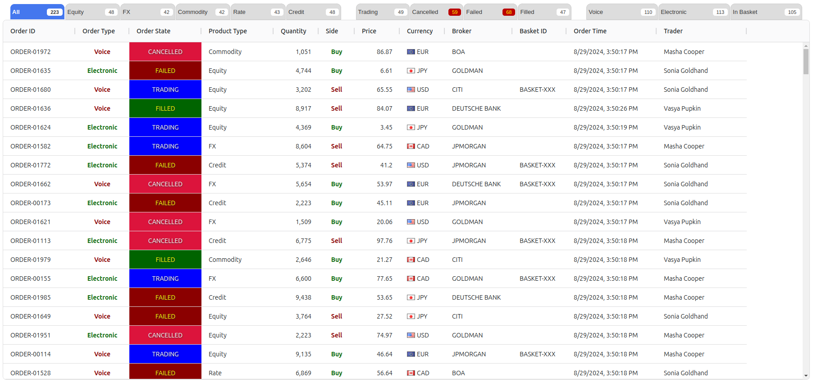

# AngularBlotterWebWorkerExample

This is an example project demonstrating performance optimization concepts when dealing with high frequency high volume updates in SPA Singe-page Application such as: distinct throttling, lazy sampling, transactional delta updates and offload heavy calculations into a separate thread with Web Workers.

## Installation

This application is written in TypeScript and is using [NodeJS](www.nodejs.org), [Angular](www.angular.dev) and [Ag-Grid](www.ag-grid.com).

Clone & cd to project, then run 

````
npm install
````

This application is only for demonstration and proving of concept purposes. 
It is not ready to use in production code.

## Task
Optimize Blotter (order grid in financial applications) for consistent, responsive and lighting speed rendering on massive data updates. Given groups of related filter tabs, allowing to quick filter displayed data in the Blotter and showing total order counts for a specific condition in a filter tab.



Here are three groups of filter tabs:
1. Product type group, mutual exclusive selection;
2. Order state group, multiple selection. Counters reflect Product type group selection;
3. Extra mixed selection group, e.g. "Voice" and "Electronic" filters are mutual exclusive, but Basket filter tab is not. Order counts reflect product and state groups selections.

Below is an example of selecting Commodity electronic and basket orders in Cancelled or Failed state


Example application generates 10000 random orders (new and updates by OrderId) with high random frequency. 

Application receives order updates, it throttles update events and picks only most recent order updates by interval, then it sends resulting small batch of updates for delta transaction update/rendering to the Blotter grid and to the Web Worker for order counts calculation. 

Worker keeps it's tab/orders data in sync by receiving tab configuration /selection changes and batches of order updates from main application. Since data is copied between thread it is important to maintain small batches to minimize costs of serialization/deserialization between threads.

Worker uses lazy sampling to performs calculation of counts by interval and only if there are changes.

Application is using [Ag-Grid](www.ag-grid.com) for the Blotter. Ag-Grid supports delta/transaction updates for speed rendering of changes.
